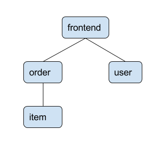
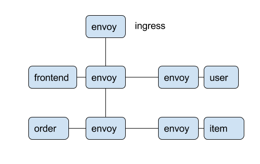

# Kubernetes Envoy Example

A sample application using [Envoy](https://lyft.github.io/envoy/) running in Kubernetes.

## Motivation

I wanted to learn more about Envoy, so I decided to do it "the hard way." I wrote
the contrived example application and pieced together the Envoy configurations
from the documentation and examples.

## Sample Application Summary

The sample application is fairly straight forward.  It has four components:

* _frontend_ - HTTP service written in Go. It accepts the request from the client
and makes calls to the other services.
* _user_ - [gRPC](https://grpc.io/) service written in Go. Manages user information.
* _order_ - [gRPC](https://grpc.io/) service written in Go. Tracks orders. Makes calls
to the _item_ service for details about each ordered item.
* _item_ - [gRPC](https://grpc.io/) service written in PHP (more on this below).
Inventory of items.

The basic flow of data through the service is



Services do not communicate directly with one another. All communication is via
Envoy.  An Envoy instance - named _ingress_ - acts as the entrypoint into the cluster.
This is similar to the "[Service to service plus front proxy](https://lyft.github.io/envoy/docs/intro/deployment_types/front_proxy.html)" example.

The network flow of data is



## Services Detail

Each instance of each service runs in a [Kubernetes pod](https://kubernetes.io/docs/concepts/workloads/pods/pod/). Each pod has multiple
containers:

* the application itself
* Envoy proxy
* [statsd_exporter](https://github.com/prometheus/statsd_exporter) - Envoy emits metrics using [statsd](https://lyft.github.io/envoy/docs/intro/arch_overview/statistics.html?highlight=statsd). `statsd_exporter` is a statsd server that exposes these metrics
fo consumption by [Prometheus](https://prometheus.io/). 

The ingress contains only Envoy and statsd exporter.

The Envoy container in each pod listens on one port (8080)
for incoming requests and routes these to the local application running within the pod.
Envoy listens on a different port (7070) for outbound requests.  Applications make
requests to http://127.0.0.1:7070 for other services rather than connecting direct.
See [order.json](./deploy/envoy/order.json) for example.

All the applications expose metrics for Prometheus.

The frontend is the user facing service. It accepts HTTP/1.1 requests on the front and
makes gRPC requests to the other services.

The item service uses [grpc-fastcgi-proxy](https://github.com/bakins/grpc-fastcgi-proxy) to expose a simple PHP applciation.  This service could represent a legacy system
written in PHP that we wish to expose.

The other services - user and order - are simple gRPC services written in Go.

## Tracing

[Zipkin](http://zipkin.io/) is used for tracing. Envoy is [configured](https://lyft.github.io/envoy/docs/intro/arch_overview/tracing.html)
to send tracing information to Zipkin.

The applications do not send any data to Zipkin. They only ensure the tracing headers
are [propogated](https://lyft.github.io/envoy/docs/install/sandboxes/zipkin_tracing.html).

## Service Discovery

Envoy handles all service discovery - the applications just contact Envoy on lcoal host.
[Kubernetes headless services](https://kubernetes.io/docs/concepts/services-networking/service/#headless-services) are used. This means a DNS request for the service will return a record for each running Pod.
This is a simple service discovery mechanism that does not require additional helper services.


## Usage

This example is designed to be ran on [minikube](https://github.com/kubernetes/minikube). 
A working [Go](https://golang.org/doc/install) environment is required.
Once minikube is installed and running, one should clone this repository into 
the GOPATH:

```shell
mkdir -p $HOME/go/src/github.com/bakins
git clone https://github.com/bakins/kubernetes-envoy-example.git
cd kubernetes-envoy-example
```

Now to build and deploy the example applications:

* `./script/build` will build the applications and push Docker images into
the minikube Dcoker environment.
* `./script/deploy` will deploy the Kubernetes manifests.

After a few seconds, you should be able to access the applciation by running
`minikube service ingress` - you should see a simple json body.

To access ZipKin, run `minikube service zipkin`. Refresh the ingress application a few times
and then click "Find Traces" in ZipKin and you should see traces.

Prometheus is available via `minikube service prometheus`.  You should be able to
run adhoc [queries](https://prometheus.io/docs/querying/basics/) for metrics.

TODO: grafana dashboards

## LICENSE

See [LICENSE](./LICENSE)